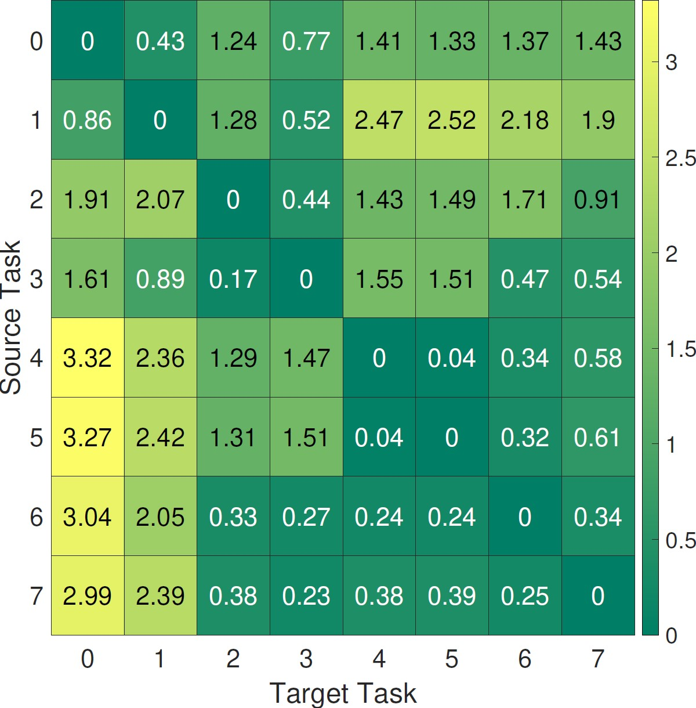
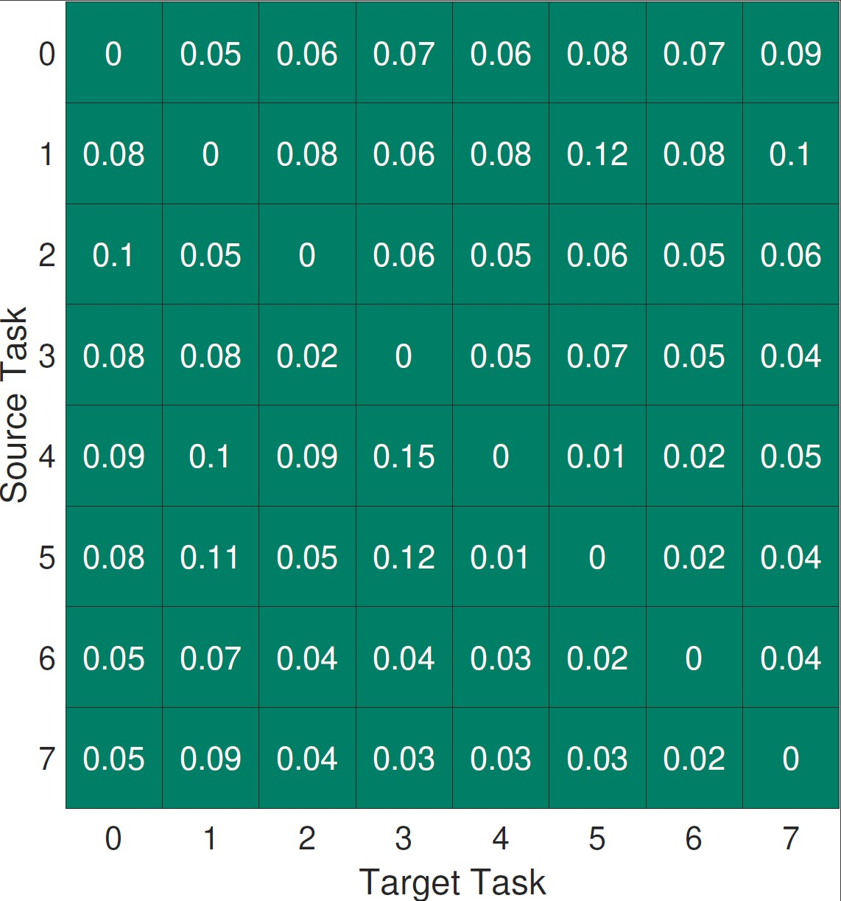

# Neural Architecture Search From Task Similarity Measure
This is the source code for Neural Architecture Search From Task Similarity Measure (https://arxiv.org/pdf/2103.00241.pdf)

## Description

In this paper, we propose a neural architecture search framework based on a similarity measure between some baseline tasks and a target task. We first define the notion of the task similarity based on the log-determinant of the Fisher Information matrix. Next, we compute the task similarity from each of the baseline tasks to the target task. By utilizing the relation between a target and a set of learned baseline tasks, the search space of architectures for the target task can be significantly reduced, making the discovery of the best candidates in the set of possible architectures tractable and efficient, in terms of GPU days. This method eliminates the requirement for training the networks from scratch for a given target task as well as introducing the bias in the initialization of the search space from the human domain.

## Getting Started

### Dependencies

* Requires Pytorch, Numpy
* MNIST dataset (https://www.kaggle.com/oddrationale/mnist-in-csv)
* CIFAR-10 (https://www.cs.toronto.edu/~kriz/cifar.html)

### Executing program

* First, we define tasks in MNIST and CIFAR-10 dataset and use the CNN to train on each task. The weights of the trained CNN is saved for each task.
```
python train_task_mnist.py
python train_task_cifar_repeat.py
```
* Next, we compute the Fisher Information matrices for each pair of tasks using the base task's network. Then, we identify the closest tasks based on the log-determinant of the Fisher Information matrices
```
python log_det_distance.py
```
Lastly, the FUSE algorithm is applied to find the suitable architecture for the incoming task:
```
python NAS_FUSE.py
```

### Results
The confusion matrix below shows the distance matrix of 8 baseline tasks from MNIST, CIFAR-10 datasets.
<p align="center">
  
  
</p>

The table below indicates the performance of the TA-NAS in comparison with state-of-art image classifiers on Quick, Draw! dataset.
| Architecture | Error (%) | Paramameters (M) | GPU days |
| :---         |    :---:  |     :---:        |  :---:   |
| ResNet-18    | 1.42      |  11.44    | - |
| ResNet-34    | 1.20      |  21.54    | - |
| DenseNet-161 | 1.17      |  27.60    | - |
| Random Search               | 1.33      |  2.55    | 4 |
| FUSE w. standard space      | 1.21      |  2.89    | 2 |
| FUSE w. task-aware space    | 1.18      |  2.72    | 2 |


## Authors

Cat P. Le (cat.le@duke.edu), 
<br>Mohammadreza Soltani, 
<br>Robert Ravier, 
<br>Vahid Tarokh